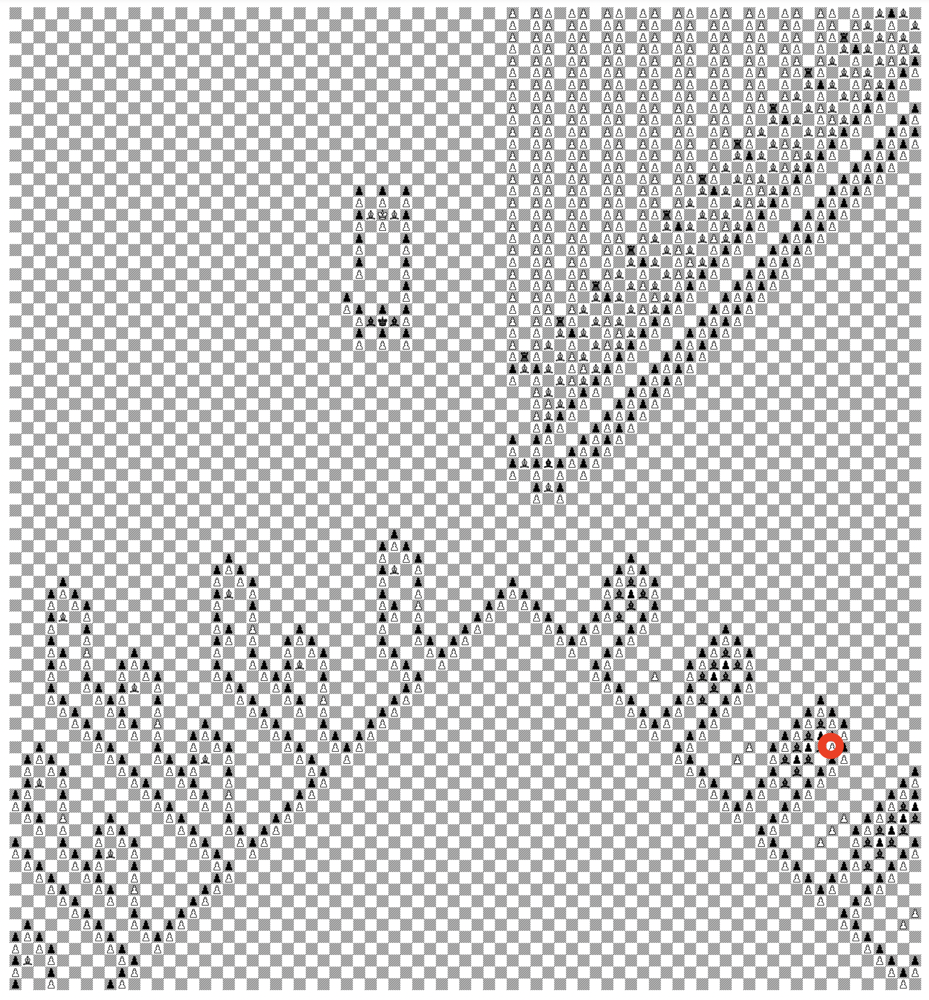

# Explanation of Mistake in $\omega^4$ Game Value Paper

Here is the pawn that was mistakenly placed when it should have been an empty square:

Here is an outline of an analysis of how it changes the valuation:

## Black's First Move

Black to move with 4 possible first moves:

* Take the misplaced pawn with the black pawn to the top left
* Fire a bishop cannon
* Initiate a rook tower
* Move the main bishop

The paper has proven that of options 2-4, #4 yields the highest game value of $\omega^4$, so there are really only two valid options for this analysis.

Black taking the misplaced pawn is a critical mistake, as the main bishop that started the whole chain gets captured, and whites bishops are instantly freed. White can deliver mate before the bishop trapped directly above the misplaced pawn can escape.

## White's First Move

So black must move their main bishop, which lets white have two choices:

* Capture the main bishop, continuing down the main line
* Use the misplaced pawn to capture black's pawn

When the main bishop is captured, white is forced to play the main line where black can move their rook tower extremely far, giving them ample time to capture the misplaced pawn and have their bishops escape from within the cannon.

So to avoid mate, white must capture black's pawn within the cannon using their misplaced pawn.

## Black's Second Move

Now that the misplaced pawn is in a location where neither player can interact with it, the cannon that the misplaced pawn was located in is effectively the same as any other cannon.

Since Black's main bishop is still alive, it can bury into the bottom border of the rook tower structure. It will get captured by the pawn to the bottom left of it (capture by bottom right leads to forced mate for black), but now preventing white from any forward progress in the rook tower structure. Since white is unable to make any extra progress, black can continue firing cannons into eternity to force a stalemate.